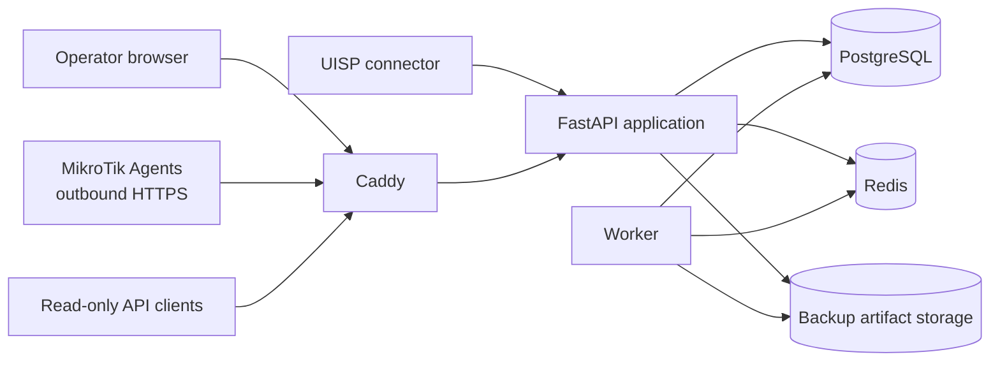

# NSM Platform

NSM Platform is a customer-edge network operations, security, backup, firmware and evidence platform for ISP/WISP environments.

Its primary scope is **equipment installed at customer premises or otherwise serving the customer edge**. It is designed to normalize operational state across vendors while preserving an auditable history of important actions and observations. It complements vendor controllers, monitoring systems and ACS platforms; it is not intended to replace an ISP backbone/core NMS.

**Documentation snapshot:** 2026-09-30.  
**Repository visibility:** public — committed examples, tests and documentation must contain synthetic/public-safe data only.

## Start here

Developers and coding agents should read these documents before changing runtime behavior:

1. [`docs/README.md`](docs/README.md) — documentation map and source-of-truth rules;
2. [`docs/IMPLEMENTED_CAPABILITIES.md`](docs/IMPLEMENTED_CAPABILITIES.md) — what is actually present in `main`;
3. [`docs/ROADMAP.md`](docs/ROADMAP.md) — current priorities, acceptance gates and future work;
4. [`docs/ARCHITECTURE.md`](docs/ARCHITECTURE.md) — runtime, data, Agent and connector architecture;
5. [`docs/DEVELOPMENT_WORKFLOW.md`](docs/DEVELOPMENT_WORKFLOW.md) — PR sizing, priority and validation rules;
6. [`docs/PUBLIC_REPOSITORY_DATA_SAFETY.md`](docs/PUBLIC_REPOSITORY_DATA_SAFETY.md) — mandatory public-repository data policy;
7. [`docs/PRODUCT_REQUIREMENTS.md`](docs/PRODUCT_REQUIREMENTS.md) — durable product requirements and design intent.

Before implementing anything, also inspect **current `main` and all open PRs**. Chat history and old PR descriptions are not authoritative when they conflict with current code.

## Status legend

| State | Meaning |
| --- | --- |
| **Implemented** | Runtime behavior exists in `main` and has automated coverage. |
| **Validation pending** | Code exists, but a required physical-device/vendor acceptance step is still open. |
| **In progress** | Work exists in an active focused PR and is not part of `main` yet. |
| **Planned** | Product direction is approved but runtime implementation has not been completed. |

## Current product status

| Area | Status | Current position |
| --- | --- | --- |
| Core inventory / Customer / Site / Device | **Implemented** | Customer-centric hierarchy, CRUD, filters, pagination, search and CSV import. |
| Audit / Action Center / Notifications | **Implemented** | Append-only operational evidence foundations, worklists and contextual browser actions. |
| Backup framework | **Implemented** | Capability-aware policy hierarchy, scheduler/retry/retention, artifacts and device-scoped explorer. |
| MikroTik modern Agent | **Implemented + validation pending** | Enrollment, heartbeat, jobs, telemetry, configuration, diagnostics, backup and firmware workflow are present; some backup hardening still requires physical acceptance. |
| MikroTik legacy Agent | **Implemented + validation pending** | RouterOS 7.12.x enrollment/heartbeat/basic state and historical telemetry exist; structured configuration parity is under physical acceptance; backup parity is not implemented. |
| Ubiquiti / UISP | **Implemented foundation** | Read-only connector, encrypted credential storage, MAC association, manual and periodic refresh with backoff/connector health, normalized inventory. Richer operations are planned. |
| TR-069 / ACS CPE | **Planned foundation** | Capability/model placeholders exist; no production ACS connector is currently implemented. |
| Firmware operations | **Implemented foundation** | Customer-aware worklist plus MikroTik readiness, approval, download-only staging, activation and RouterBOOT lifecycle. Vendor intelligence remains incomplete. |
| Vulnerability / lifecycle | **Implemented foundation** | Data models and operator worklists exist. Automated source ingestion and reliable version matching remain planned. |
| Public read-only API | **Implemented** | API-key protected inventory, backup, vulnerability and firmware endpoints with scoping. |
| Incident Timeline / Root Cause | **Planned** | Approved roadmap feature, not yet a runtime capability. |
| Compliance Baseline | **Planned** | Approved roadmap feature, not yet a runtime capability. |
| Executive / NIS2 reports | **Implemented foundation** | Manual PDF/CSV evidence reports with SHA-256 archive and audit. Scheduling and delivery are planned. |

See [`docs/IMPLEMENTED_CAPABILITIES.md`](docs/IMPLEMENTED_CAPABILITIES.md) for the detailed capability-by-capability truth table.

## Development priority

Until explicitly changed, select work in this order:

1. **runtime bugs and regressions** affecting existing workflows;
2. **MikroTik Agent / RouterOS compatibility defects**, including enrollment, heartbeat, jobs, snapshots, diagnostics, backup and update/rollback behavior;
3. **GUI defects and broken operator workflows**;
4. roadmap features only after the active defect/acceptance queue is under control.

Current acceptance and implementation gates are maintained in [`docs/ROADMAP.md`](docs/ROADMAP.md). Do not infer completion from a menu entry, model, route or passing unit test alone when physical-device validation is explicitly required.

## Runtime architecture



The default Compose deployment contains PostgreSQL, Redis, an Alembic migration service, the FastAPI/Uvicorn API, a worker process and Caddy. Backup artifacts are stored outside the container filesystem through the configured backup volume.

More detail: [`docs/ARCHITECTURE.md`](docs/ARCHITECTURE.md).

## MikroTik security boundary

MikroTik management is intentionally outbound from the router to NSM.

- enrollment uses a short-lived one-time token;
- every enrolled Device receives its own persistent credential;
- Agent operations are explicit, allow-listed job types;
- NSM does **not** expose a generic arbitrary RouterOS command/shell channel;
- browser actions and machine-facing Agent endpoints have separate error contracts;
- capability checks determine which operations are exposed for each Agent/RouterOS family.

The modern and legacy RouterOS paths are deliberately separate where scripting/transport behavior differs.

## Ubiquiti / UISP integration

UISP is an active, read-only integration used by the application for Ubiquiti inventory association and refresh. The current connector uses the UISP Network device endpoint implemented in source (`/nms/api/v2.1/devices`) and stores the connector credential encrypted at rest.

NSM Customer/Site ownership remains authoritative. UISP organization/site metadata must never silently re-parent NSM records.

Only external API contracts that are **actually used by runtime code** should be documented. Historical, experimental or unused third-party API references do not belong in this repository documentation.

## Backup model

Backup coverage is capability-aware. An enabled policy does not mean a Device is protected unless NSM also has an executable backup method for that Device.

Policy precedence is:

1. Device;
2. Site;
3. Customer;
4. Vendor;
5. Global.

For supported modern MikroTik devices, NSM implements encrypted RouterOS `.backup` transfer and optional `.rsc` export transfer through authenticated, chunked outbound HTTPS. The server verifies and archives artifacts and exposes device-scoped download, delete, text preview and same-device diff functionality where appropriate.

## Browser UI contract

Human-facing browser actions should keep the operator inside the NSM interface and use contextual one-shot feedback (`success`, `info`, `warning`, `error`) plus Post/Redirect/Get where appropriate.

Machine-facing Agent, connector and public API endpoints retain structured HTTP/JSON contracts. Do not solve a browser UX bug with a global exception handler that changes machine API behavior.

## Public repository safety

Never commit real operational data. In tests, examples and screenshots use deterministic synthetic values:

- RFC 5737 IPv4 documentation networks;
- `example.test` / `example.invalid` DNS names;
- locally administered MAC addresses such as `02:...`;
- `TEST-*`, `CI*` or generated identifiers;
- synthetic Customers, Sites and Devices.

Never commit production tokens, API keys, private keys, enrollment credentials, customer configurations, real backup artifacts, runtime logs or database data. The repository includes an automated public-data-safety guard; do not weaken it to accommodate copied deployment data.

## Screenshots

Interface screenshots are useful documentation, but only **sanitized demo screenshots** are acceptable in this public repository. No authenticated/sanitized running NSM UI was available while this documentation snapshot was prepared, so no screenshot has been fabricated or copied from a real deployment.

When a safe demo instance is available, add captures under `docs/images/` following the checklist in [`docs/README.md`](docs/README.md). Screens must contain synthetic Customers, Devices, addresses and identifiers only.

## Deployment and update

The normal validated flow is:

```text
main -> CI -> deployment host -> update.sh -> database migration -> health verification
```

Installation and auto-update helpers live in the repository. Runtime secrets, database files, backups and environment-specific configuration are intentionally excluded from Git.

`update.sh` performs a PostgreSQL logical backup before migration/deployment and refuses unsafe source/runtime combinations. Auto-update failure diagnostics remain local by default for public-repository safety.

Operational entry point: [`README-FIRST.md`](README-FIRST.md).

## Definition of done

A feature is not complete merely because a model, route, button or placeholder exists. Where applicable, completion requires:

- actual backend/Agent/connector behavior;
- authorization and capability enforcement;
- usable GUI and explicit unsupported/error states;
- audit/evidence behavior;
- automated regression coverage;
- physical-device/vendor validation when simulation cannot prove compatibility;
- documentation update;
- green CI.

See [`docs/DEVELOPMENT_WORKFLOW.md`](docs/DEVELOPMENT_WORKFLOW.md) for the complete engineering contract.
