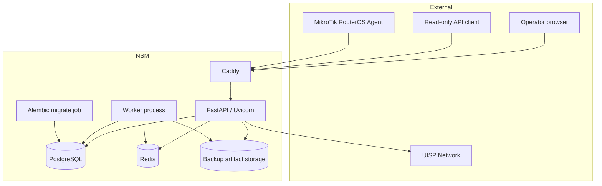
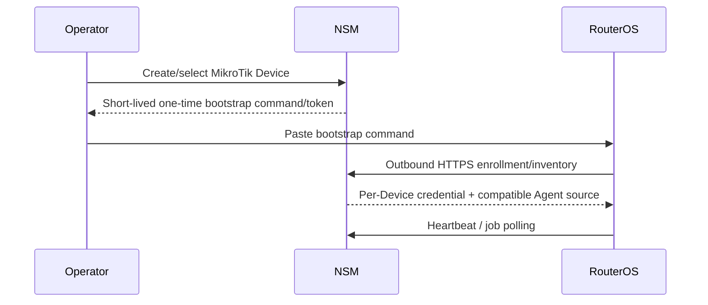
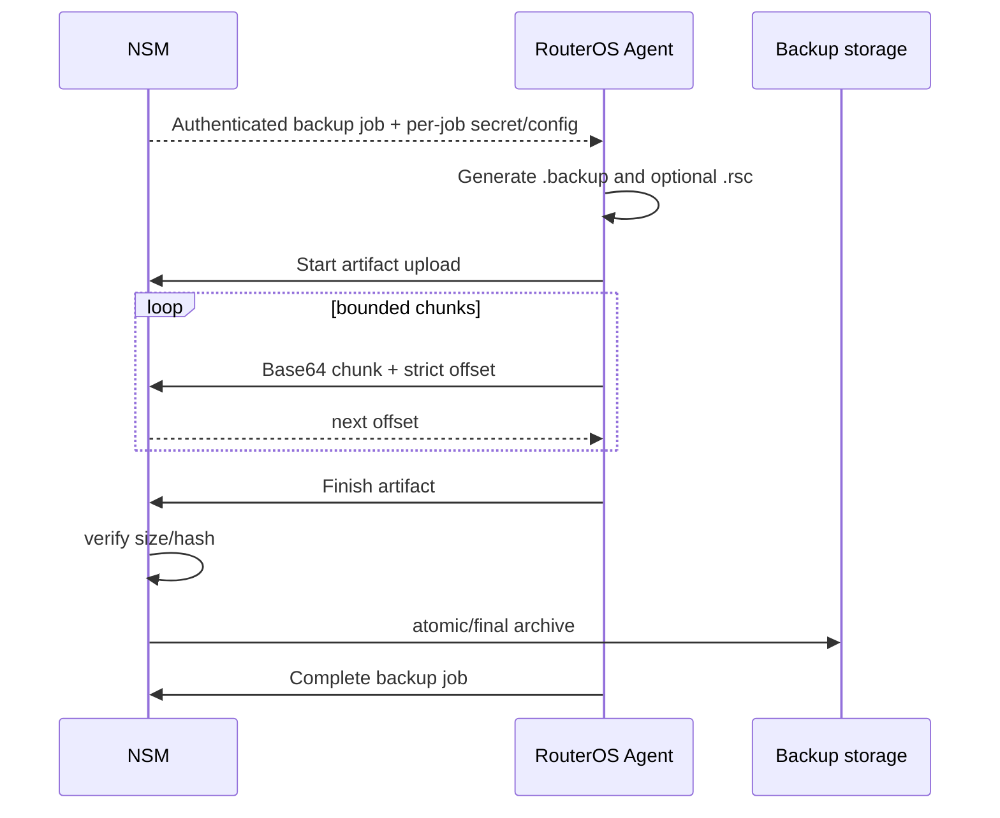
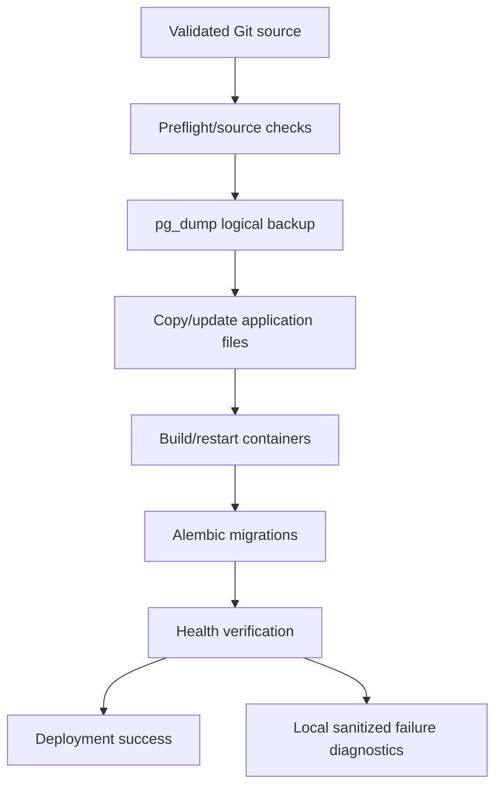

# NSM Platform — Architecture

Status: **current architecture reference**  
Snapshot: **2026-09-30**

This document describes the technical boundaries visible in current `main`. It should be updated when process, trust, storage or data-ownership boundaries materially change.

## 1. Product boundary

NSM is a multi-vendor customer-edge operations/evidence platform.

Primary responsibilities:

- Customer/Site/Device inventory;
- normalized observed state;
- lightweight monitoring/history;
- configuration and backup evidence;
- firmware workflows;
- security/lifecycle worklists;
- Action Center, notifications and audit;
- connector/Agent orchestration;
- future incident/compliance/reporting evidence.

Non-primary responsibilities:

- ISP backbone routing engineering;
- BGP optimization;
- OSPF/MPLS/VPLS topology management;
- backbone capacity engineering;
- replacement of a full NMS.

## 2. Logical architecture



The production/default Compose layout contains:

- PostgreSQL;
- Redis;
- a one-shot Alembic migration container;
- FastAPI/Uvicorn API container;
- worker container;
- Caddy front end;
- host-mounted backup artifact storage;
- persistent Caddy volumes.

Application secrets and deployment-specific bootstrap secrets are supplied outside version control.

## 3. Repository/runtime separation

The Git checkout is source. The active application runtime is a separate deployment tree.

Important rule: deployment code must never treat the runtime directory as the source repository. `update.sh` validates its source and refuses unsafe same-source/runtime execution before destructive copy steps.

Runtime state excluded from Git includes:

- environment secrets;
- database files;
- Redis runtime data;
- backup artifacts;
- reports/evidence/uploads;
- operational logs.

## 4. Canonical data ownership

```text
Customer
├── Site (optional, owned by exactly one Customer)
│   └── Device
└── Device without Site (allowed)
```

### Customer

NSM is authoritative for Customer identity and ownership.

### Site

A Site is customer-local, not a globally shared network POP object.

Server-side invariants:

- Site belongs to exactly one Customer;
- Device can only reference a Site owned by its Customer;
- connector metadata must not silently move a Device between NSM Customers/Sites.

### Device

Device identity separates operator naming from observed identity.

Conceptually important fields include:

- editable display alias;
- observed system/device identity;
- vendor/model/board;
- serial and MAC identifiers;
- architecture where relevant;
- management address/source;
- installed firmware;
- desired/recommended firmware state separately;
- last seen / operational state;
- external connector identifier when relevant.

Observed values and desired values must not be conflated.

## 5. Web application boundary

The FastAPI application serves both human-facing HTML and machine-facing endpoints.

### Human browser actions

Expected validation/stale-state outcomes should:

- stay inside the NSM GUI;
- use safe internal redirect targets;
- use one-shot contextual feedback;
- use Post/Redirect/Get where appropriate;
- avoid raw JSON/stack traces for routine operator errors.

### Machine-facing endpoints

Agent, connector/upload and public API endpoints retain explicit HTTP/JSON contracts.

Do **not** introduce a global exception conversion layer that turns every API error into browser HTML.

## 6. Authentication and authorization boundaries

### Browser sessions

Operators authenticate through the web application. Route/domain permission checks enforce access to Customers, Devices, backup, firmware, security and administration actions.

### Public API keys

The read-only public API uses API-key authentication with scoped permissions and optional Customer scope. Browser administration of keys is separate from machine API behavior.

### MikroTik Device credentials

Each enrolled RouterOS Device receives its own persistent Agent credential. There is no global shared RouterOS secret.

### Connector credentials

External connector credentials such as the UISP token are encrypted at rest using the platform encryption mechanism.

## 7. MikroTik Agent architecture

### Enrollment



Core properties:

- outbound connection initiated by RouterOS;
- one-time enrollment token;
- per-Device permanent credential;
- server selects compatible Agent family/capabilities;
- modern and legacy transports remain separate where RouterOS scripting behavior differs.

### No arbitrary remote shell

The server does not send arbitrary operator-provided RouterOS commands. Agent work uses explicit allow-listed job types with fixed/validated semantics.

This is a durable architecture rule.

## 8. RouterOS compatibility model

Compatibility is capability-driven, not assumed from one universal script.

The server resolves/persists information such as:

- Agent family/transport;
- RouterOS compatibility profile;
- supported Agent operations;
- installed Agent version/state.

UI actions should rely on the same capability contract used by the backend. A feature must not be shown as executable merely because it exists for another RouterOS family.

Current families include a modern path and a RouterOS 7.12.x-compatible legacy path.

## 9. Agent job lifecycle

Generic Agent jobs use explicit lifecycle states such as pending, delivered and terminal success/failure states.

Key invariants:

- expired pending jobs that can no longer be delivered are failed by maintenance;
- stale delivered non-backup jobs are failed after their explicit deadline;
- backup jobs have their own lifecycle/maintenance owner and are not blindly finalized by generic job expiry;
- Agent completion must remain authenticated and Device/job scoped;
- terminal completion is intended to be idempotent so a late retry cannot resurrect/overwrite terminal state (active hardening work is tracked in the roadmap).

Long-running/new job types should define timeout and idempotency ownership explicitly rather than relying on indefinite `delivered` rows.

## 10. MikroTik telemetry flow

```text
RouterOS heartbeat / supported telemetry job
        ↓
authenticated Agent endpoint
        ↓
normalized current Device state
        ↓
metric sample history where supported
        ↓
Monitor / Agent Fleet / health worklists
```

Legacy transport may encode/transport values differently, but server-side consumers should receive normalized state wherever parity is implemented.

## 11. MikroTik configuration snapshot flow

Modern supported flow:

```text
Operator / scheduled action
        ↓
allow-listed snapshot job
        ↓
RouterOS collects fixed supported sections
        ↓
Agent completion payload
        ↓
normalized DeviceJob result
        ↓
Configuration workspace / health derivation
```

The pending RouterOS 7.12.x parity implementation follows the same normalized result contract but uses a fixed plain-text `rows-v1` wire format rather than requiring modern serialization behavior.

Arbitrary source supplied in a job payload is not allowed.

## 12. MikroTik backup architecture

### Policy resolution

Effective backup policy specificity:

```text
Device > Site > Customer > Vendor > Global
```

Policy existence is not sufficient for protection status. NSM also needs an executable backup capability for that Device.

### Modern RouterOS transfer



Important controls:

- unique per-job backup password;
- secret encrypted at rest;
- strict offsets;
- maximum artifact size;
- zero-length non-empty-upload chunks rejected;
- SHA-256 verification/evidence;
- temporary/incomplete server-side upload state cleaned on terminal finalization;
- authenticated download through NSM;
- device-scoped Explorer isolation.

Physical acceptance for additional RouterOS-side no-progress/temp-file cleanup hardening remains tracked in the roadmap.

## 13. Firmware workflow architecture

Current MikroTik firmware flow is deliberately staged rather than a one-click uncontrolled update.

```text
Observed Device state
   ↓
Readiness check
   ↓
Upgrade plan
   ↓
Explicit approval
   ↓
Download-only staging
   ↓
Activation / expected reboot
   ↓
Agent acknowledgement / post-action verification
```

RouterBOOT is treated as a related but distinct lifecycle/action concern.

Future firmware intelligence must keep installed version, target version, channel/source and security/bugfix evidence separate.

## 14. UISP connector boundary

UISP is currently a read-only external connector used for Ubiquiti Device association and manual inventory refresh.

Runtime code consumes the UISP Network device endpoint:

```text
/nms/api/v2.1/devices
```

Current normalization includes available identity/model/serial/MAC/IP/firmware/status/last-seen data.

Rules:

- connector token encrypted at rest;
- NSM Customer/Site ownership is authoritative;
- store stable external Device ID after association;
- connector failures should be explicit and must not corrupt existing NSM ownership;
- future operations are capability-gated and should not be documented as implemented until the real API contract is used and verified.

## 15. Future ACS / TR-069 boundary

NSM should integrate with a production ACS rather than implementing a full CWMP ACS internally.

No production ACS connector is currently implemented. Therefore the architecture remains intentionally generic:

```text
NSM connector adapter
    ↕
selected ACS northbound interface
    ↕
TR-069 CPE fleet
```

When an actual connector is selected, document only the external contracts actually consumed by source code.

## 16. Audit/evidence architecture

Material operations should create durable evidence appropriate to their importance.

Examples:

- Device enrollment;
- identity/inventory changes;
- Agent update/recovery;
- backup run/artifact/delete;
- firmware plan/action;
- baseline/configuration drift actions;
- Action Center state changes;
- user/admin operations.

Evidence can reference normalized state, hashes, artifacts, job outcomes and future reports. Avoid storing sensitive raw payloads when a normalized/auditable representation is sufficient.

## 17. Action Center vs notifications vs audit

```text
Operational event
   ├── Audit: durable history/evidence
   ├── Notification: user-visible information
   └── Action Center: actionable issue requiring attention
```

Not every successful routine operation needs an Action Center issue. Failures or unresolved risk conditions may require all three surfaces depending on domain rules.

## 18. Worker and maintenance responsibilities

The worker performs recurring operational maintenance/scheduling functions. Current domains include backup scheduling/maintenance and Agent job lifecycle maintenance.

Every new recurring task should be:

- idempotent;
- bounded;
- observable through logs/evidence;
- safe to rerun;
- explicit about state ownership;
- tested independently from request handlers.

## 19. Database migrations

Schema changes use Alembic.

Deployment order must preserve the migration boundary:

1. validate source/revision;
2. create logical PostgreSQL backup;
3. run migration service;
4. start/rebuild application services;
5. verify health.

Do not use a raw copy of a live PostgreSQL data directory as the application-level database backup method.

## 20. Deployment update flow



Host-specific auto-update identity/path configuration is stored outside the public repository. Runtime failure diagnostics are local by default.

## 21. Public repository trust boundary

The public repository must contain only code and synthetic/public-safe examples.

Never move operational evidence into Git as a debugging shortcut.

Safe fixture conventions are enforced by `PUBLIC_REPOSITORY_DATA_SAFETY.md` and the repository safety checks. If reproducing a production issue requires a captured payload, sanitize it into an equivalent deterministic synthetic fixture before committing.

## 22. Architectural change checklist

Before merging a change that affects architecture, verify:

- ownership boundary still clear;
- authentication/authorization preserved;
- capability gating preserved;
- no arbitrary command channel introduced;
- browser and machine error contracts remain separate;
- retries/timeouts/idempotency defined;
- audit/evidence behavior defined;
- public-safe tests added;
- physical/vendor validation defined where needed;
- this document and `IMPLEMENTED_CAPABILITIES.md` updated if the boundary/capability changed.
